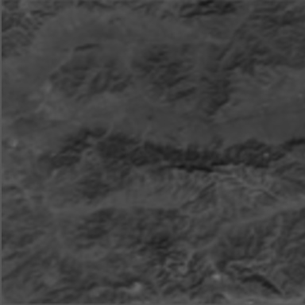
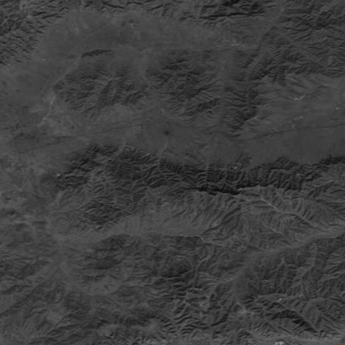
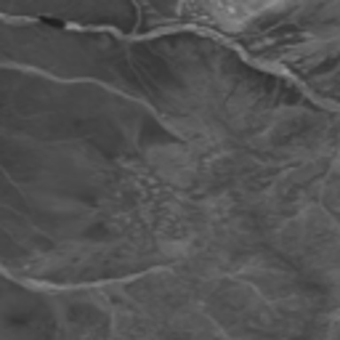
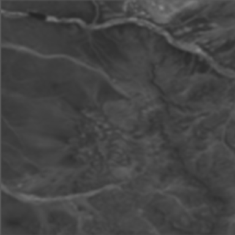
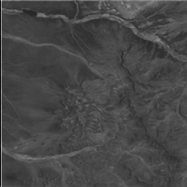
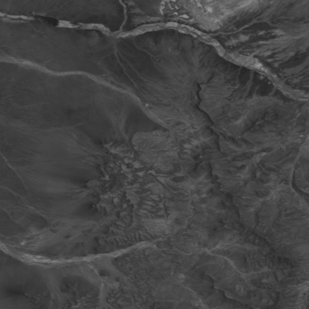

# Super-Resolution-PROBA-V-
## Overview
Non-sequential multi-frame super-resolution image generation is a method to register and fuse multiple images (normally of low quality) to recover its high resolution counterpart. This work is a PyTorch implementation with close reference to [DeepSum](https://github.com/diegovalsesia/deepsum) on [Proba-V satelite images](https://kelvins.esa.int/proba-v-super-resolution/home/) provided by ESA’s [Advanced Concepts Team](http://www.esa.int/gsp/ACT/index.html).

There are two models: without and with refinement net. The networks consist of three modules (Primary, Stn and Fusion net)(Corresponds to SISRNet, RegNet and FusionNet of DeepSum), which performs single image recovery, image/feature registration and multi-frame fusion respectively. The network with refinement net has an additional network very similar to Fusion net, which takes the residual output from fusion net as input to further refine the output.
There are some changes, which include replacing Global Dynamic Convolution with spatial transformer network (to support registration given affine transformation, though current net only concentrate on translations), and the inclusion of structural similarity index measure for loss generation. This modified network is denoted SRNet1.

SRNet1 is improved by changing Primary Net to a two stream network (with lateral connection in between), where one stream concentrates on features from image with the original size (which is large), but with low channel number, whereas the other stream down samples the image to extract much global features and with higher channel number. This net is denoted as SRNet2.

## Implementation
### Require
PyTorch (ver 1.0.0 used), TorchVision (ver 0.2.1 used), Python-OpenCV (ver 4.1.0 used)
### Train
Proba-V dataset can be obtained [here](https://kelvins.esa.int/proba-v-super-resolution/data/). 
Set the training data path configurations through arguments before training:
```
"--trainDataPath" : Training set folder path (For example, D:/dataset/probav_data/train/NIR) 
```
Primary Net and Stn Net requires pretraining, before performing end-to-end training that includes Fusion Net. The training sequence is: Primary net pre-training, Stn Net pre-training and end-to-end training. Types of training can be specied by the following argument:
```
"--mode" : Mode of implementation, where
          "primaryT" for Primary Net pre-training
          "stnT" for Stn Net pre-training
          "allT" for end-to-end training
```

To train from scratch, follow the following sequence:

Primary Net pre-training, with example as follows:
```
python main.py --trainDataPath D:/dataset/probav_data/train/NIRtrain --batchSize 16 --mode primaryT
```
which will generate primaryParam_xx.dict files.

To pre-train Stn net, it needs primaryParam.dict file (renaming the most recent primaryParam_xx.dict):
```
python main.py --trainDataPath D:/dataset/probav_data/train/NIRtrain --batchSize 16 --mode stnT
```
which will generate stnParam_xx.dict files.

Finally, with primaryParam.dict and stnParam.dict, end-to-end training is performed as follows:
```
python main.py --trainDataPath D:/dataset/probav_data/train/NIRtrain --batchSize 16 --mode allT
```
which will generate wholeParam_xx.dict files.

### Usage
One can use the trained network to perform multi-frame super-resolution by first placing images in ./inputImg folder (minimum 9), and execute main.py with argument 
```
"--mode" = "allU"
```
Trained parameter file "wholeParam.dict" and example images in ./inputImg folder are included in the git.

### Test
Comparison test is performed between refined and non-refined output. From Proba-V training dataset folder, 156 scenes are selected from NIR, and 149 samples are selected from RED for testing, the remaining are used for training. The scores based on [here](https://kelvins.esa.int/proba-v-super-resolution/scoring/) are as follows:

Table 1: Result for SRNet1

| Dataset Group  | Before Refinement |After Refinement |
| ------------- | ------------- |------------- |
| NIR  | 0.9861 |0.9819  |
| RED  | 0.9934  |0.9882  |

Table2: Result for SRNet2

| Dataset Group  | Before Refinement |After Refinement |
| ------------- | ------------- |------------- |
| NIR  | 0.9724 |0.9710  |
| RED  | 0.9819  |0.9783  |


#### Output

##### Example 1
<p float="left">
  
   
  
  
</p>
From left to right: 1. One of the low resolution images 2. Bicubic upsampling + mean 3. Reconstructed image 4. Gound truth high resolution image

##### Example 2
<p float="left">
  
   
  
  
</p>
From left to right: 1. One of the low resolution images 2. Bicubic upsampling + mean 3. Reconstructed image 4. Gound truth high resolution image

 

